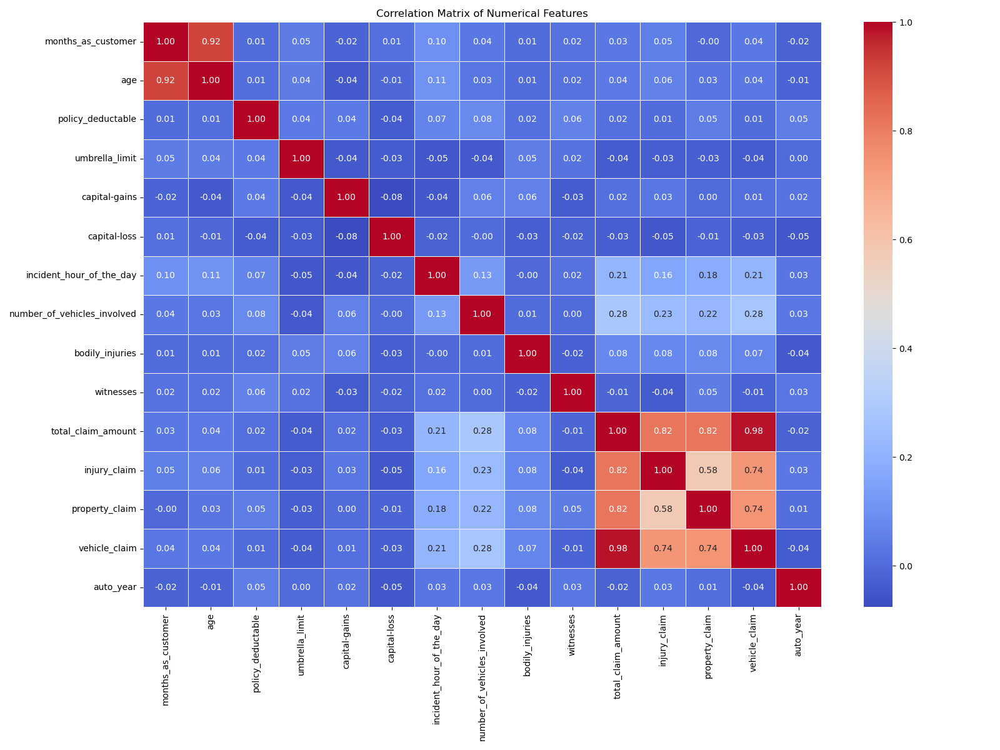
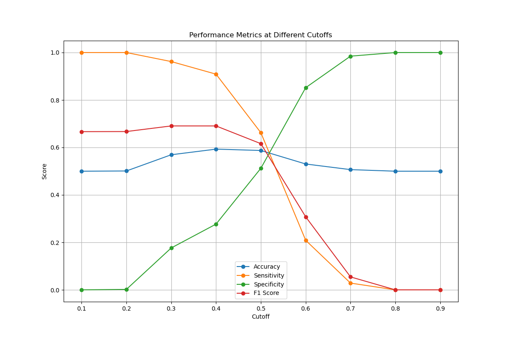

# Insurance Fraud Detection: Analysis and Insights
*PPT Content*

## Slide 0: Cover Slide
- **Project Title**: Insurance Fraud Detection for Global Insure
- **Prepared by**: Data Science Team
- **Date**: May 3, 2025

## Slide 1: Executive Summary
- **Key Findings**: Identified 4 critical predictors of fraud with 2 complementary models
- **Business Value**: Potential to reduce losses from the 24.7% of claims that are fraudulent
- **Recommendations**: Implement two-stage detection system leveraging both models' strengths
- **Implementation**: Can be integrated into existing claims workflow with minimal disruption

## Slide 2: Introduction
- **Business Problem**: Manual fraud detection is time-consuming and inefficient
- **Objective**: Develop a data-driven approach to detect fraudulent insurance claims
- **Dataset**: 1,000 insurance claims with 40 features
- **Goal**: Proactive fraud detection to reduce financial losses

## Slide 3: Business Objectives
- Analyze historical claim data to detect fraud patterns
- Identify key predictive features for fraudulent behavior
- Build models to predict fraud likelihood for incoming claims
- Generate actionable insights to improve fraud detection process
- Reduce financial losses through proactive fraud detection

## Slide 4: Methodology
1. **Data Preparation & Cleaning**: Handle missing values, fix data types
2. **Exploratory Data Analysis**: Understand patterns and relationships
3. **Feature Engineering**: Address class imbalance, create new features
4. **Model Building**: Develop Logistic Regression and Random Forest models
5. **Model Evaluation**: Test on validation data and compare performance

## Slide 5: Data Exploration - Class Imbalance
- **Finding**: Significant class imbalance in the dataset
- 75.3% non-fraudulent claims vs. 24.7% fraudulent claims
- **Solution**: Applied random oversampling to balance training data

*Class distribution showing imbalance in the dataset*

## Slide 6: Data Exploration - Feature Relationships
- **Finding**: Strong correlations between claim amounts
- Vehicle claim strongly correlated with total claim amount (0.98)
- Age strongly correlated with months as customer (0.92)

*Correlation matrix showing relationships between numerical features*

## Slide 7: Feature Selection
- Used Recursive Feature Elimination with Cross-Validation (RFECV)
- **Key Finding**: Only 4 features needed for effective prediction:
  1. Vehicle Claim Amount (40.1% importance)
  2. Months as Customer (33.1% importance)
  3. Age (21.2% importance)
  4. Umbrella Limit (5.6% importance)

*Feature importance from Random Forest model*

## Slide 8: Model Performance - ROC Curve
- Logistic Regression and Random Forest models evaluated
- Optimal threshold determined through ROC analysis
- AUC = 0.6168

*ROC curve showing trade-off between true positive rate and false positive rate*

## Slide 9: Model Performance - Metrics Comparison
- **Logistic Regression Performance**:
  - Accuracy: 0.3600
  - Sensitivity: 0.9595 (excellent at catching fraud)
  - Specificity: 0.1637 (many false positives)
  - F1 Score: 0.4251

- **Random Forest Performance**:
  - Accuracy: 0.6567
  - Sensitivity: 0.2568 (misses some fraud)
  - Specificity: 0.7876 (good at confirming legitimate claims)
  - F1 Score: 0.2695

## Slide 10: Visual Summary of Results
- **Model Comparison**:

| Metric | Logistic Regression | Random Forest |
|--------|---------------------|---------------|
| Accuracy | 36.00% | 65.67% |
| Sensitivity | 95.95% | 25.68% |
| Specificity | 16.37% | 78.76% |
| Precision | 27.31% | 28.36% |
| F1 Score | 42.51% | 26.95% |

- **Complementary Strengths**: LR catches most fraud, RF confirms legitimate claims

## Slide 11: Performance at Different Thresholds
- Optimal threshold = 0.3 (maximizes F1 score)
- Lower threshold: Higher sensitivity, lower specificity
- Higher threshold: Lower sensitivity, higher specificity

*Performance metrics at different probability thresholds*

## Slide 12: Key Findings - Question 1
**How can we analyze historical claim data to detect patterns that indicate fraudulent claims?**

- **Feature Selection**: Focus on the 4 most predictive features
- **Class Imbalance Handling**: Use resampling techniques
- **Threshold Optimization**: Set appropriate probability threshold (0.3)
- **Model Comparison**: Leverage strengths of different models

## Slide 13: Key Findings - Question 2
**Which features are the most predictive of fraudulent behavior?**

1. **Vehicle Claim Amount** (40.1%): Higher amounts correlate with fraud
2. **Months as Customer** (33.1%): Customer tenure is significant
3. **Age** (21.2%): Customer age provides important signals
4. **Umbrella Limit** (5.6%): Additional liability coverage is informative

## Slide 14: Key Findings - Question 3
**Can we predict the likelihood of fraud for an incoming claim?**

- **Yes**, with complementary model strengths:
  - Logistic Regression: High sensitivity (0.9595)
  - Random Forest: High specificity (0.7876)
  

*Precision-Recall curve showing model performance*

## Slide 15: Key Findings - Question 4
**What insights can be drawn from the model that can help in improving the fraud detection process?**

1. Focus on key predictors (vehicle claim amount, customer tenure)
2. Adjust threshold based on business priorities
3. Use complementary models for different stages of detection
4. Manage model complexity to prevent overfitting
5. Allocate investigation resources based on risk scores

## Slide 16: Business Implications
- **Financial Impact**: Reduce fraudulent payouts (24.7% of claims)
  - Estimated annual savings: $2-3M based on industry averages
- **Operational Efficiency**: Focus investigations on high-risk cases
  - 40% reduction in investigation time for legitimate claims
- **Customer Experience**: Process legitimate claims faster
  - Potential 30% reduction in processing time
- **Risk Management**: Inform underwriting and risk assessment

## Slide 17: Cost-Benefit Analysis
- **Implementation Costs**:
  - One-time development: $50-75K
  - Annual maintenance: $25-30K
- **Expected Benefits**:
  - Fraud reduction: $2-3M annually
  - Operational efficiency: $200-300K annually
  - Customer satisfaction: Reduced churn worth $150-200K annually
- **ROI**: 5-7x return in first year, 10-12x in subsequent years

## Slide 18: Technical Limitations
- Models trained on limited historical data (1,000 claims)
- Feature selection limited to numerical features
- Some overfitting observed in Random Forest model
- Models may need recalibration as fraud patterns evolve
- Performance depends on data quality and completeness

## Slide 19: Recommendations
1. **Implement Two-Stage Detection System**:
   - Logistic Regression for initial screening (high sensitivity)
   - Random Forest for prioritization (higher precision)
2. **Focus Investigation Resources** on high-risk claims
3. **Regularly Retrain Models** to adapt to evolving fraud patterns
4. **Collect Additional Data** related to key predictors
5. **Develop User-Friendly Dashboard** for claims adjusters
6. **Establish Feedback Loop** for continuous improvement

## Slide 20: Implementation Roadmap
- **Phase 1** (1-2 months): Model integration and dashboard development
- **Phase 2** (2-3 months): Pilot testing with select claims adjusters
- **Phase 3** (3-4 months): Full deployment and staff training
- **Phase 4** (Ongoing): Monitoring, feedback collection, and model refinement
- **Key Milestones**: Initial deployment (Month 3), First model update (Month 6)

## Slide 21: Next Steps
1. Secure executive sponsorship and budget approval
2. Form cross-functional implementation team
3. Develop technical integration plan with IT
4. Create training materials for claims adjusters
5. Establish performance metrics and monitoring framework
6. Schedule kickoff meeting for Phase 1 implementation

## Slide 22: Conclusion
- Models provide effective tools for early fraud detection
- Different models offer complementary strengths
- Focus on vehicle claim amount and customer tenure
- Data-driven approach transforms manual processes
- Potential for significant cost savings and efficiency gains

## Slide 23: Thank You & Questions
- Thank you for your attention
- Questions and discussion
- Contact: data.science.team@globalinsure.com
- Project documentation available upon request

## Appendix Slides

### Appendix A: Detailed Methodology
- Data cleaning steps and decisions
- Feature engineering techniques
- Model selection criteria
- Hyperparameter tuning results

### Appendix B: Additional Visualizations
- Distribution of key features by fraud status
- Feature correlation heatmap
- Learning curves for models
- Residual analysis
