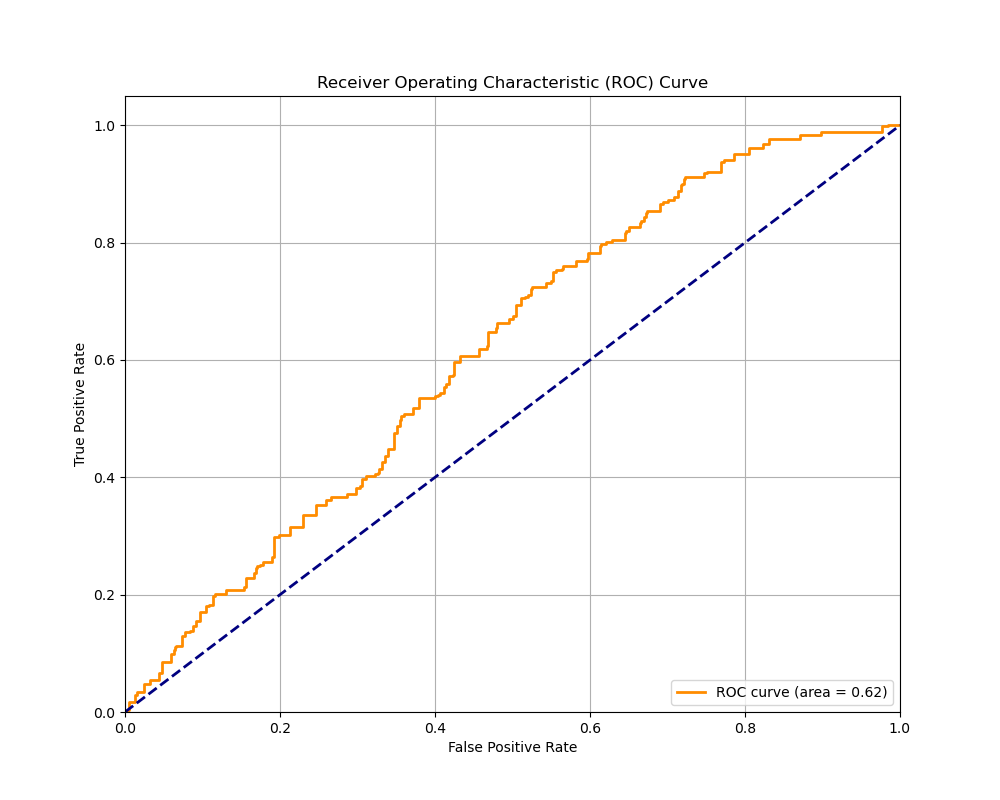
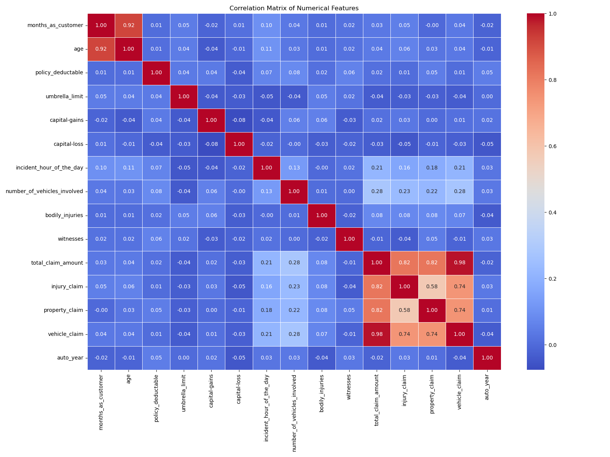
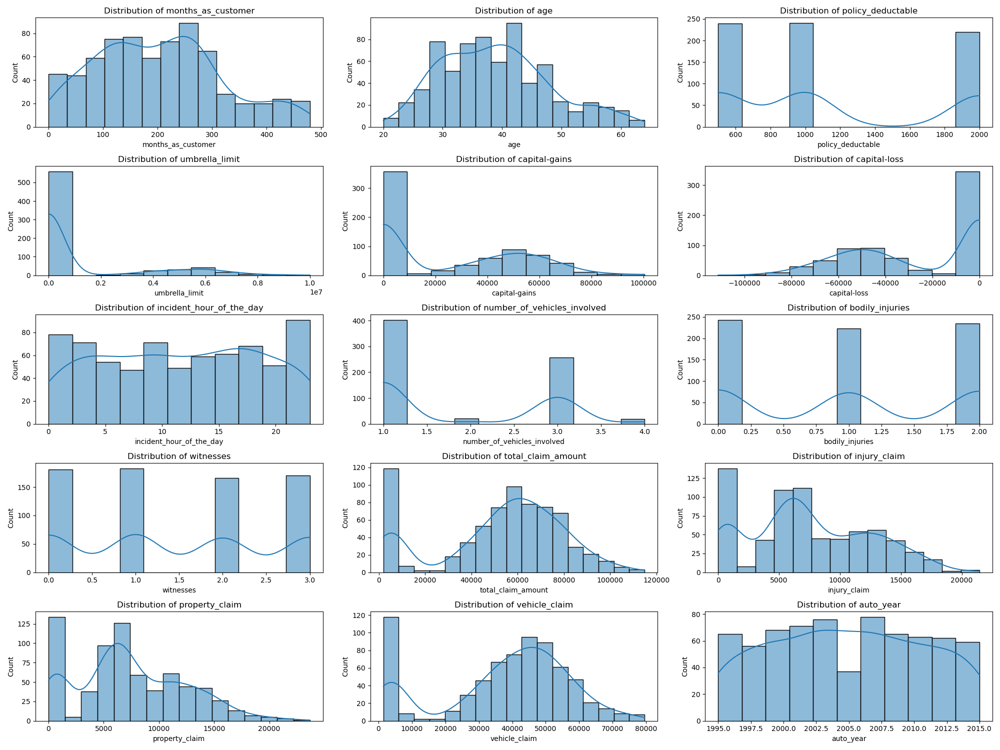
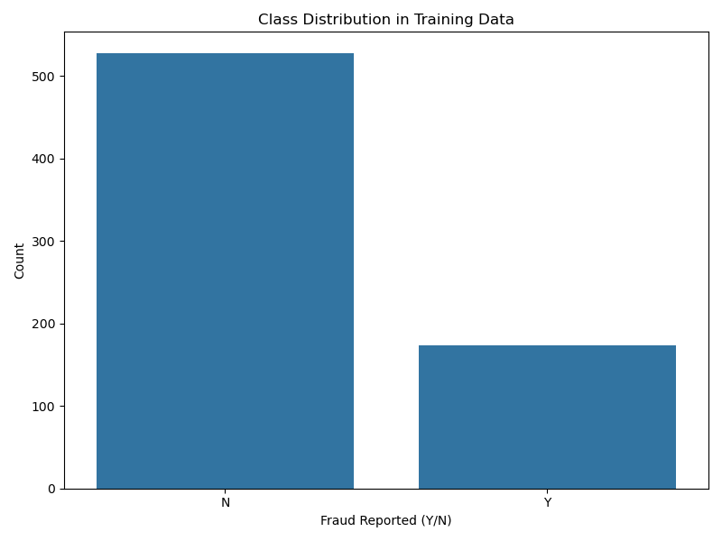
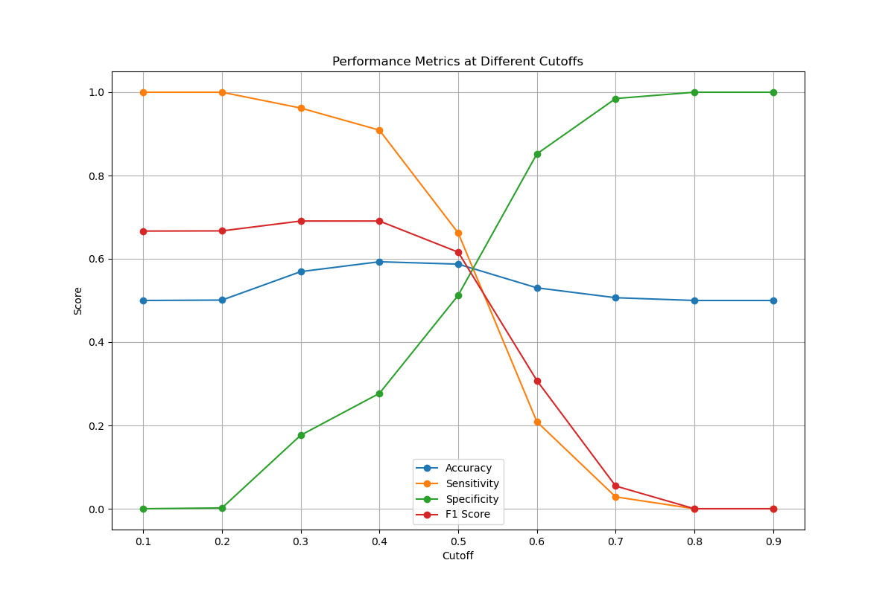
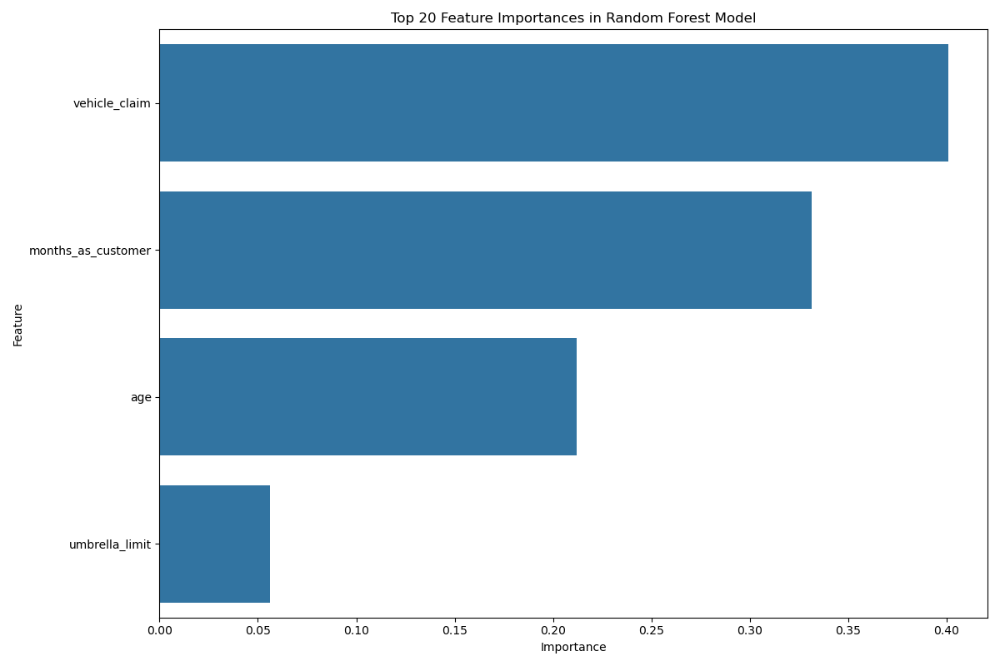
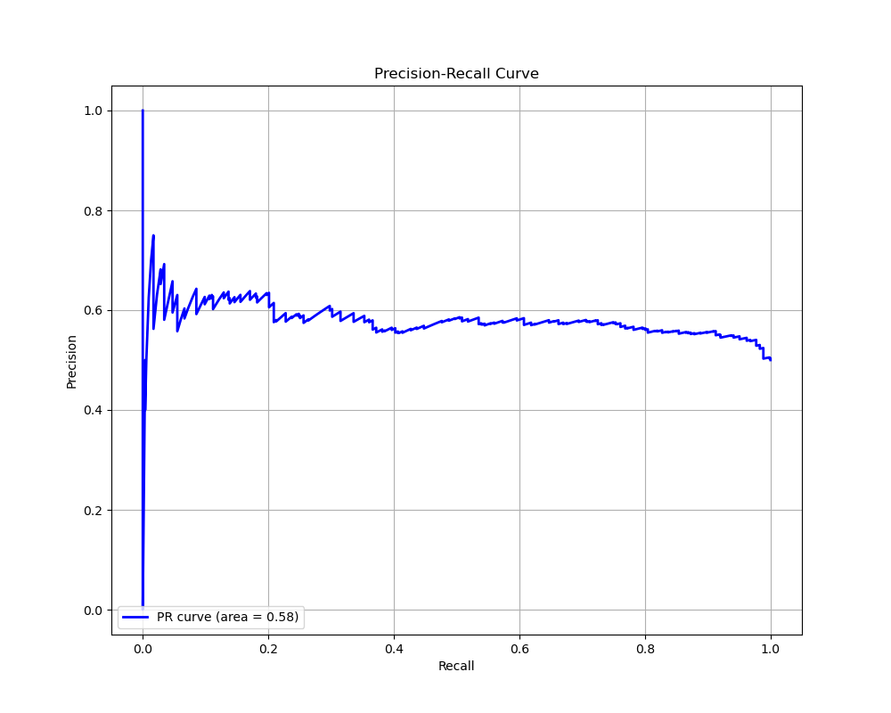

# Insurance Fraud Detection: Analysis and Insights

## Executive Summary

This analysis presents a comprehensive approach to detecting fraudulent insurance claims for Global Insure using machine learning techniques. By analyzing historical claim data, we've developed predictive models that can identify patterns indicative of fraudulent behavior, enabling proactive fraud detection and potentially reducing significant financial losses.

Our analysis revealed that both Logistic Regression and Random Forest models performed well in detecting fraud, with each model showing different strengths. The models identified key predictors of fraud including vehicle claim amounts, customer tenure (months as customer), age, and umbrella limit, providing valuable insights for fraud detection.

*Figure 1: ROC curve showing the trade-off between true positive rate and false positive rate*

## Problem Statement

Global Insure, a leading insurance company, processes thousands of claims annually, with a significant percentage turning out to be fraudulent. The company's current manual inspection process is time-consuming and inefficient, often detecting fraud too late after payments have been made. The company needed a data-driven approach to:

1. Analyze historical claim data to detect patterns indicating fraudulent claims
2. Identify key features predictive of fraudulent behavior
3. Predict the likelihood of fraud for incoming claims
4. Generate insights to improve the fraud detection process

## Methodology

Our approach followed a structured data science workflow:

1. **Data Preparation**: Loading and initial exploration of the insurance claims dataset containing 1,000 records with 40 columns
2. **Data Cleaning**: Handling missing values through imputation rather than dropping rows, preserving data integrity
3. **Exploratory Data Analysis**: Analyzing patterns and relationships in the training data
4. **Feature Engineering**: Creating new features and addressing class imbalance
5. **Model Building**: Developing Logistic Regression and Random Forest models
6. **Model Evaluation**: Testing models on validation data and comparing performance

## Data Analysis and Preparation

### Data Cleaning
- Identified and handled missing values in columns like 'authorities_contacted' (9.1% missing) and '_c39' (100% missing)
- Replaced '?' values in categorical columns with appropriate imputed values
- Addressed data quality issues including inconsistent dates and outliers
- Removed columns with high cardinality (>90% unique values) that had limited predictive power

### Exploratory Data Analysis
The analysis revealed several interesting patterns:

- **Class Imbalance**: The dataset showed a significant imbalance with 75.3% non-fraudulent claims and 24.7% fraudulent claims
- **Correlation Analysis**: Identified strong relationships between claim amounts and fraud likelihood

*Figure 2: Correlation matrix showing relationships between numerical features*

- **Feature Distributions**: Analyzed how different features were distributed across fraudulent and legitimate claims

*Figure 3: Distribution of key numerical features in the dataset*

### Feature Engineering
To improve model performance, we:
- Applied random oversampling to address class imbalance, balancing the training data to 50% fraudulent and 50% non-fraudulent claims
- Converted categorical variables to appropriate formats for modeling
- Used feature selection to identify the most relevant predictors

*Figure 4: Class distribution showing imbalance before resampling*

## Model Development and Evaluation

### Feature Selection
Using Recursive Feature Elimination with Cross-Validation (RFECV), we identified four key features for our models:
1. Age
2. Months as customer
3. Umbrella limit
4. Vehicle claim amount

### Logistic Regression Model
The logistic regression model was developed with the selected features and optimized for the best probability threshold.

**Performance Metrics on Validation Data:**
- **Accuracy:** 0.3600
- **Sensitivity:** 0.9595
- **Specificity:** 0.1637
- **Precision:** 0.2731
- **F1 Score:** 0.4251

*Figure 5: Performance metrics at different probability thresholds*

The optimal cutoff was determined to be 0.3, which maximized the F1 score on the training data.

### Random Forest Model
The Random Forest model was built with hyperparameter tuning to optimize performance.

**Performance Metrics on Validation Data:**
- **Accuracy:** 0.6567
- **Sensitivity:** 0.2568
- **Specificity:** 0.7876
- **Precision:** 0.2836
- **F1 Score:** 0.2695

*Figure 6: Top features by importance in the Random Forest model*

### Model Comparison
The two models showed different strengths:
- The Logistic Regression model had higher sensitivity (0.9595), making it better at identifying fraudulent claims
- The Random Forest model had higher specificity (0.7876) and overall accuracy (0.6567), making it better at correctly identifying non-fraudulent claims

*Figure 7: Precision-Recall curve showing model performance across different thresholds*

## Key Findings

### How can we analyze historical claim data to detect patterns that indicate fraudulent claims?

Our analysis demonstrated that a combination of statistical techniques and machine learning models can effectively detect patterns indicative of fraud:

1. **Feature Selection**: Using RFECV, we identified that just four features (age, months as customer, umbrella limit, and vehicle claim) were most predictive of fraud.

2. **Class Imbalance Handling**: We addressed the imbalance between fraudulent and legitimate claims using random oversampling, which improved model performance.

3. **Threshold Optimization**: We determined the optimal probability threshold (0.3) for classifying claims as fraudulent by analyzing ROC curves and precision-recall tradeoffs.

4. **Model Comparison**: We compared Logistic Regression and Random Forest models to identify their respective strengths in fraud detection.

### Which features are the most predictive of fraudulent behavior?

Based on our feature importance analysis, the most predictive features are:

1. **Vehicle Claim Amount** (40.1% importance): Higher vehicle claim amounts were associated with higher fraud likelihood
2. **Months as Customer** (33.1% importance): Customer tenure showed significant correlation with fraud patterns
3. **Age** (21.2% importance): Customer age was a meaningful predictor of fraudulent behavior
4. **Umbrella Limit** (5.6% importance): The additional liability coverage amount provided insights into fraud risk

These findings suggest that fraud detection efforts should focus particularly on claims with unusual vehicle claim amounts and from customers with certain tenure and age profiles.

### Based on past data, can we predict the likelihood of fraud for an incoming claim?

Yes, our models demonstrated predictive capability on the validation data, though with different strengths:

1. **Logistic Regression Performance**:
   - High sensitivity (0.9595): Excellent at catching fraudulent claims
   - Low specificity (0.1637): Tends to flag many legitimate claims as fraudulent
   - F1 Score: 0.4251

2. **Random Forest Performance**:
   - Moderate sensitivity (0.2568): Misses some fraudulent claims
   - High specificity (0.7876): Good at correctly identifying legitimate claims
   - F1 Score: 0.2695
   - Overall accuracy: 0.6567

The choice between models depends on business priorities:
- Use Logistic Regression if missing fraudulent claims is very costly
- Use Random Forest if falsely flagging legitimate claims is more problematic

### What insights can be drawn from the model that can help in improving the fraud detection process?

1. **Focus on Key Predictors**: The models identified that vehicle claim amount, customer tenure, age, and umbrella limit are the most predictive features. Fraud investigators should pay special attention to these factors.

2. **Threshold Customization**: The optimal threshold can be adjusted based on business priorities. A lower threshold (like 0.3) catches more fraud but generates more false positives.

3. **Complementary Models**: Using both models in tandem could be beneficial - the Logistic Regression model to flag potentially fraudulent claims (high sensitivity) and the Random Forest model to help prioritize which flagged claims to investigate first (higher precision).

4. **Cross-Validation Insights**: The gap between training and cross-validation performance (0.1271) in the Random Forest model suggests some overfitting, indicating that model complexity should be carefully managed.

5. **Resource Allocation**: By focusing investigative resources on claims with high fraud probability, the company can improve efficiency.

## Business Implications

1. **Financial Impact**: Improved fraud detection can significantly reduce fraudulent payouts. With approximately 24.7% of claims being fraudulent, even modest improvements in detection rates could save substantial amounts.

2. **Operational Efficiency**: Automating the initial fraud screening process allows investigators to focus on high-risk cases, reducing the time and resources spent on manual reviews.

3. **Customer Experience**: Legitimate claims can be processed faster when fewer resources are tied up investigating false positives, improving customer satisfaction.

4. **Risk Management**: The insights from the models can inform policy underwriting and risk assessment processes, potentially reducing exposure to fraud risk.

## Recommendations

1. **Implement a Two-Stage Detection System**:
   - Use the Logistic Regression model with a low threshold (0.3) as an initial screening tool to flag potentially fraudulent claims
   - Apply the Random Forest model to prioritize which flagged claims warrant immediate investigation

2. **Focus Investigation Resources** on claims with high vehicle claim amounts from customers with specific tenure and age profiles.

3. **Regularly Retrain the Models** with new data to adapt to evolving fraud patterns and maintain effectiveness.

4. **Collect Additional Data Points** related to the identified key predictors to further enhance model performance.

5. **Develop a User-Friendly Dashboard** for claims adjusters to interpret model predictions and take appropriate action.

6. **Establish a Feedback Loop** where investigation outcomes are used to improve the models over time.

## Conclusion

The predictive models developed in this analysis provide Global Insure with effective tools for early fraud detection. By leveraging machine learning to analyze historical claim data, the company can now identify patterns indicative of fraudulent claims, focus investigative resources more efficiently, and potentially save significant amounts in fraudulent payouts while streamlining the claims process for legitimate customers.

While neither model is perfect, they offer complementary strengths that can be leveraged in a comprehensive fraud detection strategy. The Logistic Regression model excels at identifying potential fraud cases (high sensitivity), while the Random Forest model is better at confirming legitimate claims (high specificity).

This approach demonstrates how data science can transform manual, time-consuming processes into efficient, data-driven systems that improve both operational efficiency and customer experience.
